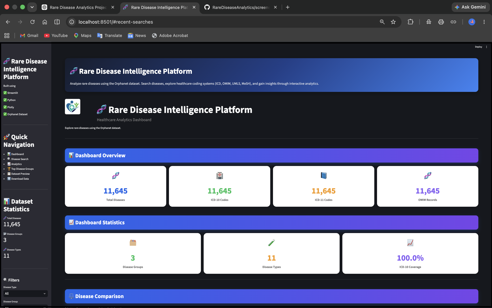
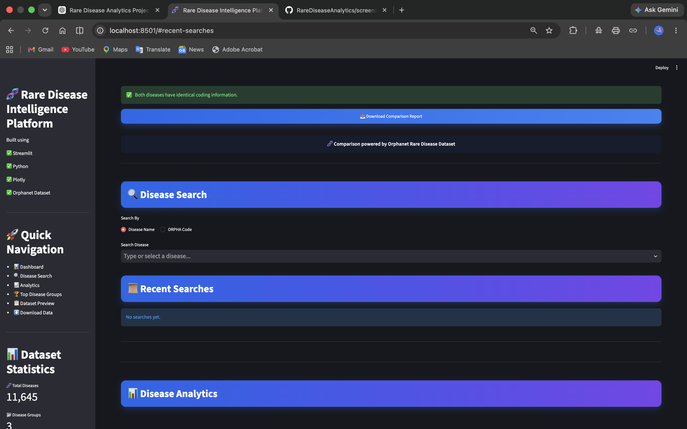
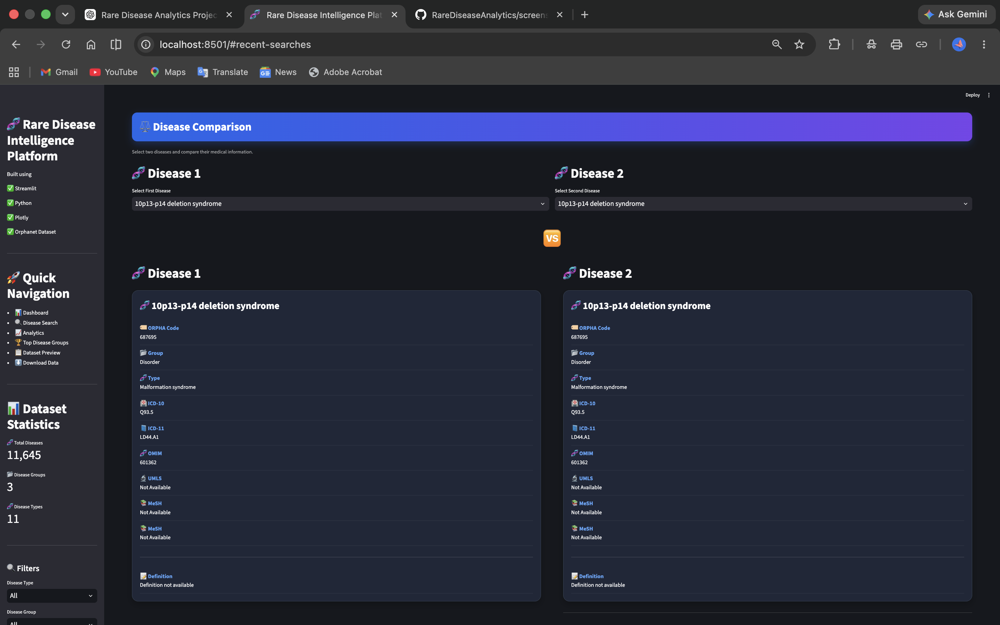
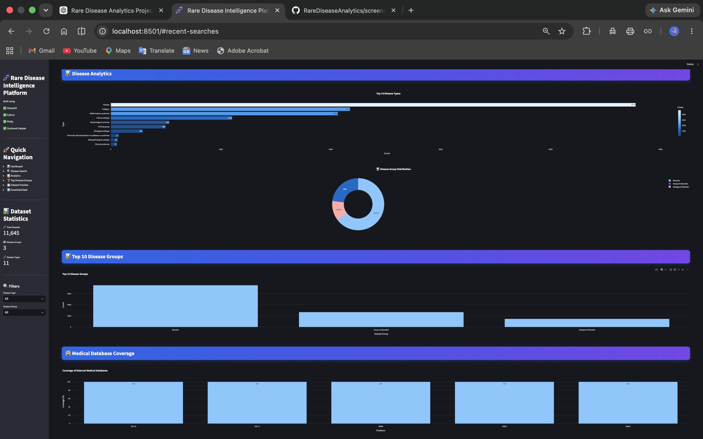

# 🧬 Rare Disease Intelligence Platform

A healthcare analytics dashboard built using the Orphanet Rare Disease Dataset.

## Features

- 🔍 Disease Search
- ⚖️ Disease Comparison
- 📊 Interactive Dashboard
- 📈 Analytics
- 📚 Medical Database Coverage
- 📋 Dataset Preview
- 📥 CSV Download

## Tech Stack

- Python
- Streamlit
- Pandas
- Plotly
- NumPy

## Dataset

Orphanet Rare Disease Dataset

## Run

```bash
pip install -r requirements.txt
streamlit run app.py
```

## Developer

Rudrakashi Kiledar

B.Tech AI & DS

Poornima College of Engineering

## 📸 Screenshots

### Dashboard



---

### Disease Search



---

### Disease Comparison



---

### Analytics Dashboard

